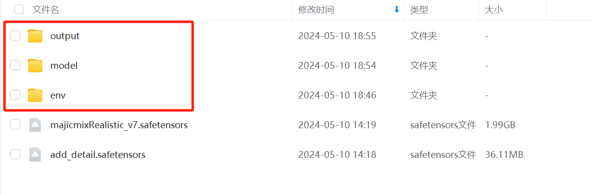
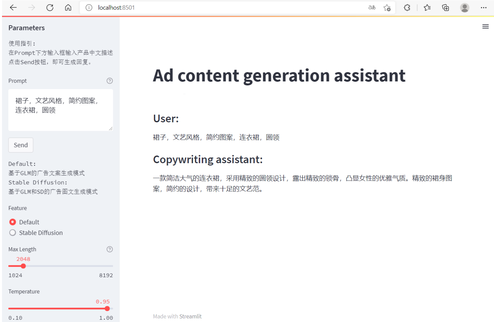
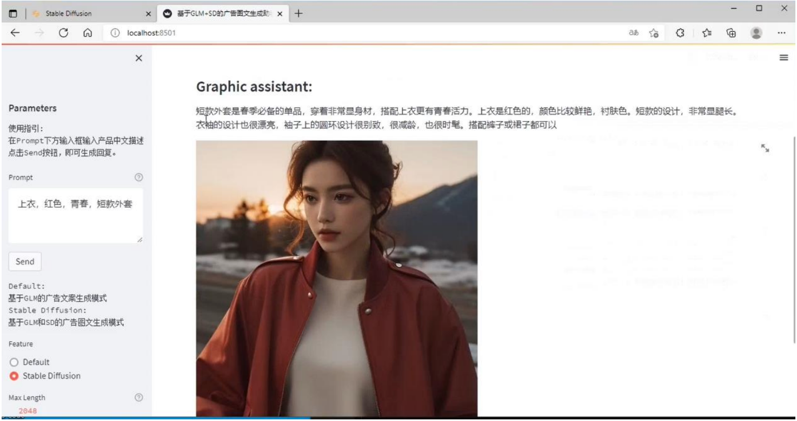

# Ad_content_generation

## introduce

   Ad_content_generation is a local deployment workflow of content generation for new media marketing advertising based on ChatGLM-6B and Stable Diffusion. The ChatGLM-6B fine-tuning model from the AdvertiseGen dataset generates advertising marketing copy and processes the copy as a Stable Diffusion prompt that will be output with the advertisement by listening to the local Stable Diffusion port.

   The project uses the strategy of combining the template and generative methods, and introduces the Lora shadow optimization model (add_detail) and Embeddings to optimize the quality of the generated image and prevent the generation of negative images through the pre-set guided dialogue model and optimized prompt words.
   Of course, this workflow scenario is not limited, and the project still has a lot of room for improvement and later plans, such as introducing Sora in the workflow of this work, expanding the mode of Vincenne Tucson video, and further improving the creation workflow of AI advertising content. Seek fine-tuning training for other application scenarios in this work mode, such as clothing design, home improvement design, etc. Fine-tuning training with data sets in different scenarios can help more non-specialists use AIGC tools in their own areas of work. It is hoped that it can promote the application development of more multimodal models in specific scenarios.

## Mode of use

### Hardware requirement
You are advised to select a device with sufficient computing power and run it with 12GB video memory and 35GB hard disk space.

### Environmental installation
Use pip to install dependencies:`pip install -r requirements.txt`
In addition, if you want to run the quantized ChatGLM model on the cpu, you also need to install gcc and openmp. Most Linux distributions are installed by default. For Windows, which can be installed in/TDM - GCC (https://jmeubank.github.io/tdm-gcc/) check ` openmp `. Windows test environment 'gcc' version is' TDM-GCC 10.3.0 ', Linux is' gcc 11.3.0 '.

### Project structure
The model files need to be placed in the specified directory for use: This includes obtaining the trained model files, including the structure and weights of the model.
Please send file [configuration file and model](https://pan.baidu.com/s/10Cxa9RTvQq9wMlrTXvZr8Q?pwd=7ngl) put the project file directory.

Please synchronous deployment [stable-diffusion-webui](https://github.com/Akegarasu/stable-diffusion-webui), here is more recommended download [consolidation_package](https://pan.quark.cn/s/2c832199b09b)  
[video address](https://www.bilibili.com/video/BV1iM4y1y7oA/?spm_id_from=333.788.0.0&vd_source=38a6ca096c69b42b176bdfa0ab4e928c)

### Run procedure
[Step guide video](https://pan.baidu.com/s/1_uIHpWqM_W0etLIxntp2Ng?pwd=f7db)

-----
## Running display

-----
## limitation
As a beginner in some aspects of processing is not very appropriate, personal development in the hardware conditions do not have much support, workflow capabilities are still insufficient, welcome to give suggestions and optimization. Here are some of the issues found so far:

- Due to ChatGLM-6B's small model capacity, its relatively weak model memory, poor performance in multiple rounds of conversation, may generate incorrect information or duplicate information.
- The project performs Ptuning tuning based on the AdvertiseGen data set. The performance learned by the fine-tuning model is generally robust, and the data set tends to the advertising copy of clothing products, which is not ideal for the generation of other categories.
- The control operation of Stable Diffusion is limited when the project generates the layout.

-----
## agreement
The code of this warehouse is open source according to [Apache-2.0](LICENSE).

-----
## acknowledgement
Thank you to the all authors of the open source components used in the project.
- [THUDM/ChatGLM-6B](https://github.com/THUDM/ChatGLM-6B)
- [LemonQu-GIT/ChatGLM-6B-Engineering](https://github.com/LemonQu-GIT/ChatGLM-6B-Engineering)
- [Akegarasu/stable-diffusion-webui](https://github.com/Akegarasu/stable-diffusion-webui)
- [AdvertiseGen data set](https://www.luge.ai/#/luge/dataDetail?id=9)
- [ChatGLM+StableDiffusion Integration package](https://www.bilibili.com/video/BV1Wa4y1V77o/?spm_id_from=333.1007.top_right_bar_window_custom_collection.content.click&vd_source=38a6ca096c69b42b176bdfa0ab4e928c)
