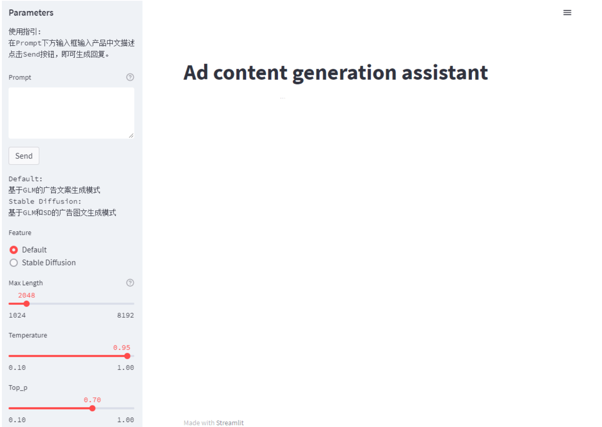

# Ad_content_generation

*Read this in [English](README_en.md).*
## 介绍

Ad_content_generation 是一个基于 ChatGLM-6B 和 Stable Diffusion 制作的新媒体营销广告**内容生成本地部署工作流**，拟通过用户在交互界面给出产品特点描述后，经 AdvertiseGen 数据集的 ChatGLM-6B 微调模型生成广告营销文案，并且处理文案作为 Stable Diffusion 的 prompt，通过监听本地 Stable Diffusion 端口将与广告配图输出。

项目使用了模板和生成式的方法相结合的策略，引入了 Lora 光影优化模型(add_detail)和 Embeddings 的处理，通过预设引导对话模型话术及优化性提示词来优化生成的图像质量，预防负面图像的生成。

当然这一工作流场景并不局限，项目仍也有许多可以提升的空间和后期计划，比如在本作品工作流上引入 Sora，拓展文生图生视频的模式，进一步完善 AI 广告内容的创作工作流；在本作品模式上寻求其他应用场景的微调训练，例如服装设计、家装设计等。通过使用不同场景下的数据集进行微调训练，可以帮助更多非专业人员在自己的工作领域中使用 AIGC 工具辅助工作。希望可以带动更多的多模态模型在特定场景下的应用开发。

-----

## 使用方式

### 硬件需求
建议选择具备足够计算能力的设备，建议在显存**12GB**及**35GB**空闲硬盘空间的条件下运行。

### 环境安装
请使用 pip 安装依赖：`pip install -r requirements.txt`
此外，如果需要在 cpu 上运行量化后的 ChatGLM 模型，还需要安装 `gcc` 与 `openmp`。多数 Linux 发行版默认已安装。对于 Windows ，可在安装 [TDM-GCC](https://jmeubank.github.io/tdm-gcc/) 时勾选 `openmp`。 Windows 测试环境 `gcc` 版本为 `TDM-GCC 10.3.0`， Linux 为 `gcc 11.3.0`。

### 项目结构
模型文件需要安置在指定目录下进行使用：包括了获取训练好的模型文件，包括模型的结构和权重等。
请将 [配置文件及模型文件](https://pan.baidu.com/s/10Cxa9RTvQq9wMlrTXvZr8Q?pwd=7ngl) 放置本项目同文件目录下。

请同步部署[stable-diffusion-webui](https://github.com/Akegarasu/stable-diffusion-webui),这里更推荐下载[整合包](https://pan.quark.cn/s/2c832199b09b) [视频地址](https://www.bilibili.com/video/BV1iM4y1y7oA/?spm_id_from=333.788.0.0&vd_source=38a6ca096c69b42b176bdfa0ab4e928c)

### 运行步骤
[演示视频](https://pan.baidu.com/s/1_uIHpWqM_W0etLIxntp2Ng?pwd=f7db)

-----
## 运行展示

-----
## 局限性
作为初学者在有些方面处理并不是很妥当，个人开发在硬件条件上没有太多支持，工作流能力仍然有许不足，欢迎各位给予建议及优化。以下是目前发现的一些问题：

- 由于 ChatGLM-6B 的模型容量较小，其相对较弱的模型记忆，在多轮对话中表现欠佳，可能会生成不正确的信息或者重复信息。
- 项目基于 AdvertiseGen 数据集进行 Ptuning 微调，微调模型所学习的表现鲁棒性一般，且数据集趋于服装类类产品广告文案，对于其他类别的生成并不理想。
- 项目生成配图时，对 Stable Diffusion 的控制操作较为局限。

-----
## 协议
本仓库的代码依照 [Apache-2.0](LICENSE) 协议开源，

-----
## 致谢
对项目使用到的开源组件的作者们表示感谢，希望大家可以移步到他们的主页，请不要吝啬你们的 Star 及一键三连。
- [THUDM/ChatGLM-6B](https://github.com/THUDM/ChatGLM-6B)
- [LemonQu-GIT/ChatGLM-6B-Engineering](https://github.com/LemonQu-GIT/ChatGLM-6B-Engineering)
- [Akegarasu/stable-diffusion-webui](https://github.com/Akegarasu/stable-diffusion-webui)
- [AdvertiseGen广告文案生成数据集](https://www.luge.ai/#/luge/dataDetail?id=9)
- [ChatGLM+StableDiffusion整合包](https://www.bilibili.com/video/BV1Wa4y1V77o/?spm_id_from=333.1007.top_right_bar_window_custom_collection.content.click&vd_source=38a6ca096c69b42b176bdfa0ab4e928c)
